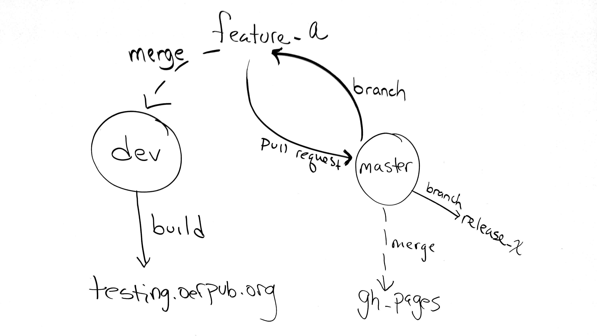

# How we use branches:
* We have two long lived branches -- master and dev. 
* Pull requests go from feature and fix branches to master.
* Releases and gh-pages will run off of master.
* New features or bug fixes branch from master.
* Dev is for integration testing. Feature and fix branches get merged here for immediate testing.  

# Integration with redmine
OERPUB is using [redmine.oerpub.org](http://redmine.oerpub.org) for tracking issues to the editor. When developers
are fixing bugs or adding ticketed features, they should reference the ticket in the commits as explained here:
[Referencing-issues-in-commit-messages](http://www.redmine.org/projects/redmine/wiki/RedmineSettings#Referencing-issues-in-commit-messages)

# Workflow 1: OERPUB developer creating a new feature or fixing a bug.
1. Make a feature-or-fix branch off of master.
2. Develop and test on the branch.
3. Merge to dev and build on testing.oerpub.org
4. When testing passes, issue a pull request from the feature-or-fix branch to master.
5. Someone not-affiliated with the branch will review the request.
   * 5A. Pull request is accepted
     * merge pull-request into master
     * merge master to gh-pages
     * optional: make a release branch off master and release the new feature or fix to remix.oerpub.org
   * 5B. Pull request is not accepted
     * Resolve the problem or
     * Revert the merge on dev or
     * Create a new dev branch from master
6. Delete the feature-or-fix branch

# Workflow 2: CNX developer creating a new feature or fixing a bug.
1. Make a feature-or-fix branch off of master.
2. Develop and test on the branch.
3. Issue a pull request to master.
4. OERPUB team will review the pull request and if reasonable, pull the branch to dev and test. 
5. If the testing passes, do 5A from above, otherwise 5B.
6. Delete the feature-or-fix branch.

# Workflow 3: Outside developer creating a new feature or fixing a bug.
0. Fork the repo.
1. Create a great new feature or fix a really annoying bug on a branch off of master.
2. Test it like crazy.
3. Issue a pull request to master on our repo.
4. If the pull request looks interesting, our team will pull the branch over to "dev" and test it. If the testing passes, do 5A from above, otherwise 5B.

